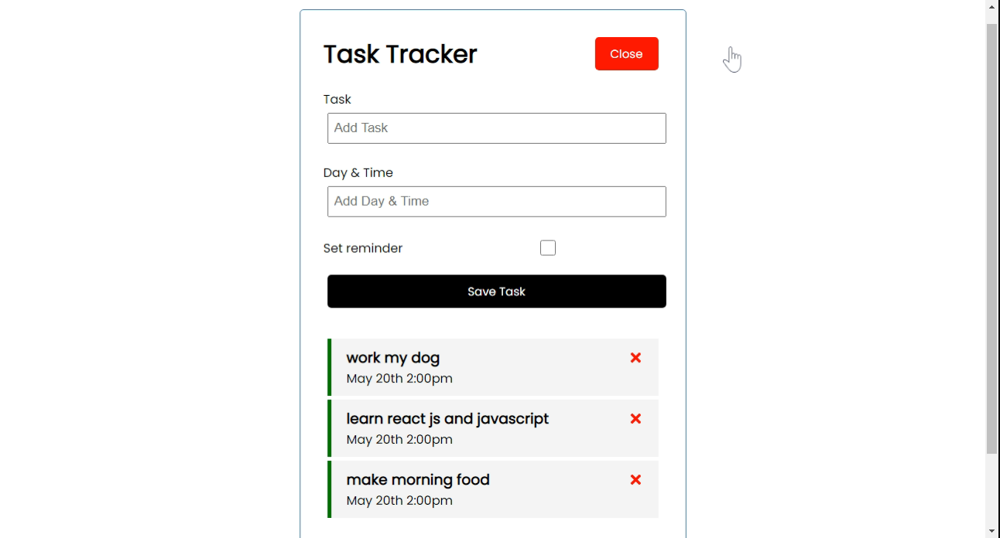

# Task-Tracker

> Task Tracker is a tool that helps manage everyday work more efficiently..
> Live demo [cooming soon](https://www.example.com). <!-- If you have the project hosted somewhere, include the link here. -->

## Table of Contents
* [Technologies Used](#technologies-used)
* [Features](#features)
* [Screenshots](#screenshots)
* [Usage](#usage)
* [Project Status](#project-status)
* [Contact](#contact)
<!-- * [License](#license) -->


## Technologies Used
* Node- version 16.13.0
* React - version 18.1.0
* Express - version 4.18.1
* Mongodb - version 4.6.0

## Features
List the ready features here:
- add and delete task
- set reminder

## Screenshots

<!-- If you have screenshots you'd like to share, include them here. -->

## usage

- Client side
- 
 ```
$ cd client
$ npm start

```

- Server side
- 
```
$ cd server 
$ npm start

```
## Project Status
Project is:  _in progress_.


## Contact
Created by [@oba.code]([https://www.flynerd.pl/](https://www.instagram.com/oba.code/)) - feel free to contact me!

